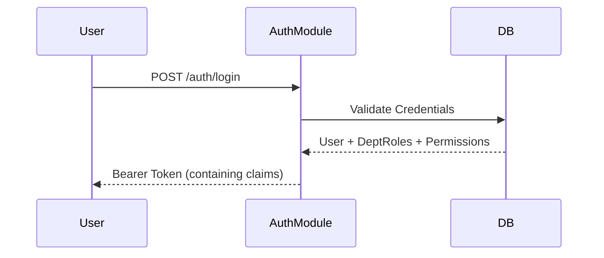

# 🦅 EagleNet Logistics - Enterprise Parallel Orchestration Engine

Welcome to the **EagleNet Logistics Core API**. This is a mission-critical, feature-modular backend designed for high-concurrency freight operations, customs regulatory compliance, and automated financial settlement.

The system is architected as a **Parallel Workflow Engine**, allowing multiple departments to collaborate on a single shipment simultaneously without blocking state transitions.

---

## 🏗️ System Architecture & Data Design

### 1. Feature-Modular "Bounded Contexts"
The codebase is strictly organized into domain-specific modules, ensuring low coupling and high cohesion:
- **`auth/users/roles/permissions`**: Tiered Identity Access Management (IAM).
- **`shipments/workflow`**: The state machine driving the logistics engine.
- **`financial/payments`**: Autonomous invoicing and Paystack-integrated transaction ledger.
- **`documents`**: Version-controlled artifact storage with S3/B2 integration.
- **`notifications/audit`**: Real-time event propagation and forensic logging.

### 2. Parallel Role-Based & Attribute-Based Access Control (RBAC/ABAC)
Unlike traditional flat role systems, EagleNet implements a **Department-Aware Permission System**:
- **Parallel Roles**: A user can be an `Admin` in the **Operations** department while simultaneously being a `Viewer` in the **Finance** department.
- **Permission Scopes**: Dynamic scoping (`own`, `department`, `all`) allows granular data visibility based on the user's current context.
- **JSON Extensibility**: All major entities (`Department`, `User`, `Shipment`) include a `metadata` `jsonb` field for schema-less expansion of enterprise-specific attributes.

---

## 🔄 The Comprehensive Operational Flow

### 🌊 Phase 1: Initiation & Identity
Every action starts with a secure handshake. The system uses signed JWTs with departmental claims.



### 🚢 Phase 2: Parallel Shipment Orchestration
Once a shipment is created, it enters a "Collaboration State".

1. **Shipment Creation**: `POST /shipments` generates a unique `trackingNumber` (e.g., `EGL-AF-2026-0001`).
2. **Parallel Workflows**: The system initializes `workflow_steps`. Multiple departments (e.g., *Warehouse*, *Customs*, *Operations*) can start their respective tasks in parallel.
3. **Collaborators**: Departments are assigned to the shipment via `shipment_collaborators`, granting their staff access to specific lifecycle actions.

#### 📦 Shipment Structure (JSON Data Design)
The system leverages structured JSON for flexibility:
```json
{
    "trackingNumber": "EGL-AF-10293",
    "type": "air_freight",
    "status": "pending",
    "metadata": {
        "priority": "express",
        "hazmat": false,
        "temperature_controlled": true
    },
    "collaborators": ["dept-id-operations", "dept-id-customs"]
}
```

### 🛂 Phase 3: Customs & Regulatory Gateway
Shipments requiring clearance are linked to the `customs_clearances` module.
- **Status Progression**: `pending_documents` ➡️ `under_examination` ➡️ `duty_paid` ➡️ `released`.
- **Checkpoint Synchronization**: Every customs status change automatically triggers a `ShipmentLog` entry and updates the public `Tracking` timeline.

### 💰 Phase 4: Financial Settlement & Ledger
The financial lifecycle is decoupled from logistics to allow for asynchronous billing.

1. **Invoicing**: Total amounts are calculated dynamically based on weights, volumes, and service types.
2. **Transaction Bridge**: `POST /payments/initialize` creates a gateway link.
3. **Webhook Reconciliation**: Upon successful payment, the Paystack webhook (`POST /payments/webhook`) notifies the engine, which:
   - Marks the `Invoice` as `PAID`.
   - Records the `Payment` reference in the immutable ledger.
   - Triggers an email notification to the client.

### 📜 Phase 5: Document Versioning & Compliance
Documents (Waybills, Invoices, Certificates) are stored with full version history:
- **Versioning**: Every upload (`POST /documents/{id}/version`) increments the `version_number`.
- **Privacy Scopes**: `GLOBAL` (Public), `DEPARTMENT` (Internal), or `PRIVATE` (Uploader only).

---

## 🛠️ Developer Operations (DevOps)

### Initial Setup
Ensure your `.env` contains:
- `DATABASE_URL`: PostgreSQL connection string.
- `JWT_SECRET`: For cryptographic signing.
- `PAYSTACK_SECRET_KEY`: For financial processing.
- `B2_KEY_ID / B2_APPLICATION_KEY`: For S3-compatible document storage.

### Commands
| Command | Description |
| :--- | :--- |
| `npm run dev` | Starts the hot-reloading development server via `ts-node-dev`. |
| `npm run migration:run` | Syncs the Postgres schema with the current entity definitions. |
| `npm run migration:generate` | Automatically detects entity changes and generates a new SQL migration. |
| `npm run create:ceo` | Utility script to seed the initial Superadmin/CEO user. |

---

## 📊 Monitoring & Auditability
EagleNet maintains a **Write-Only Forensic Ledger**:
- **Audit Logs**: Every sensitive action (logins, deletions, permission changes) is recorded with timestamp, IP, and the user agent.
- **Shipment Logs**: A detailed history of every status swap, including notes on who made the change and why.

---
*Built for the future of global logistics by the EagleNet Technical Operations Team.*
